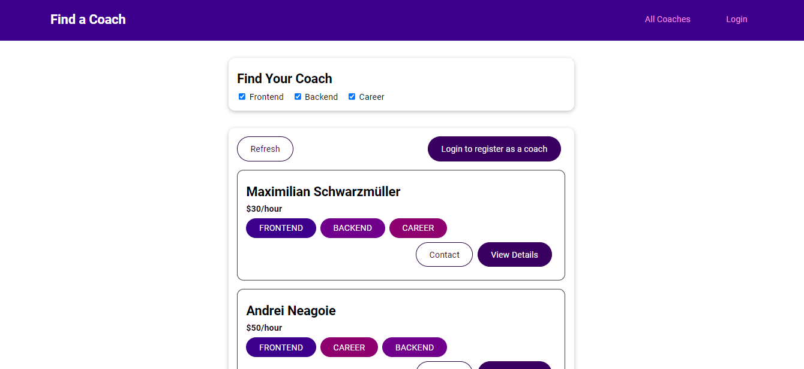

# Find-a-coach

<div id="top"></div>


<!-- PROJECT LOGO -->
<div align="center">
<br>
  <p align="center">
  <a href="http://find-a-coach-gamma.vercel.app/">View Demo</a>
    ·
    <a href="https://github.com/abdrahmansoltan/Find-a-coach/issues">Report Bug</a>
  </p>
</div>

<!-- TABLE OF CONTENTS -->
<details>
  <summary>Table of Contents</summary>
  <ol>
    <li>
      <a href="#about-the-project">About The Project</a>
      <ul>
        <li><a href="#users">Users</a></li>
        <li><a href="#validation">Validation</a></li>
        <li><a href="#built-with">Built With</a></li>
      </ul>
    </li>
    <li>
      <a href="#getting-started">Getting Started</a>
      <ul>
        <li><a href="#installation">Installation</a></li>
        <li><a href="#ports">Ports</a></li>
      </ul>
    </li>
    <li><a href="#contributing">Contributing</a></li>
  </ol>
</details>

<!-- ABOUT THE PROJECT -->

## About The Project

A web app built with **Vue.js** which to help finding a coach. It has the "find a coach" feature, and has a feature to send request-messages to potential coaches which you want to contact.



### Users

- You have to sign-up/login first to be able to sign up as coach.
- anyone can send requests to coaches
- only coaches can read their request-messages

### Validation

- **Email validation**: must contain `@`.
- **Password validation**: must be more than **6** characters.

---

### Built With

- Vue
- Javascript
- Firebase

<p align="right">(<a href="#top">back to top</a>)</p>

---

<!-- GETTING STARTED -->

## Getting Started

This project require some perquisites and dependencies to be installed, you can view it online using this [demo](http://find-a-coach-gamma.vercel.app/). or you can find the instructions below:

> To get a local copy, follow these simple steps :

### Installation

1. Clone the repo
   ```sh
   git clone https://github.com/abdrahmansoltan/Find-a-coach.git
   ```
2. Go to project folder

   ```sh
   cd find-a-coach
   ```

3. Install dependencies

   ```bash
   npm run install
   ```

4. Lints and fixes files

   ```bash
   npm run lint
   ```

5. Run development server

   ```sh
   npm run serve
   ```

#### Ports

- Server runs on port `8080`

<p align="right">(<a href="#top">back to top</a>)</p>

---

<!-- CONTRIBUTING -->

## Contributing

Contributions are what make the open source community such an amazing place to learn, inspire, and create. Any contributions you make are **greatly appreciated**.

If you have a suggestion that would make this better, please fork the repo and create a pull request. You can also simply open an issue with the tag "enhancement".
Don't forget to give the project a star! Thanks again!

1. Fork the Project
2. Create your Feature Branch (`git checkout -b feature/AmazingFeature`)
3. Commit your Changes (`git commit -m 'Add some AmazingFeature'`)
4. Push to the Branch (`git push origin feature/AmazingFeature`)
5. Open a Pull Request

<p align="right">(<a href="#top">back to top</a>)</p>
